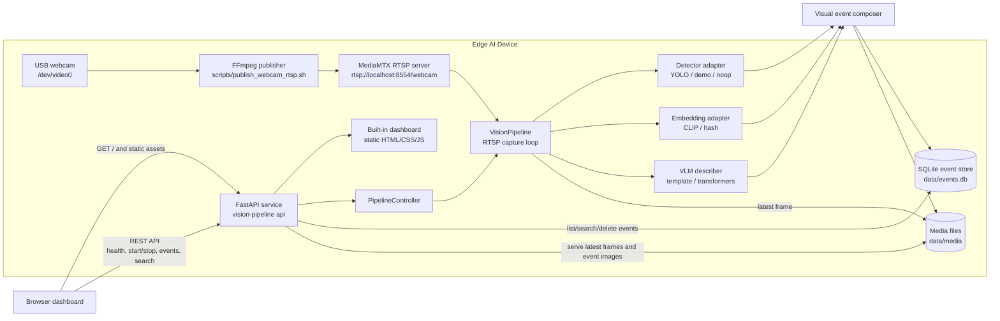

# Vision Pipeline

Open-source edge AI vision pipeline for an NVIDIA DGX Spark with a USB webcam. The starter turns the webcam into an RTSP source, samples the stream for object-detection events, stores event frames and metadata, embeds events for semantic recall, and exposes a web dashboard for search and review.

## AI Pipeline At A Glance

```text
USB webcam or test pattern
  1280x720 at 30 FPS default publisher, RTSP over TCP
    -> MediaMTX RTSP stream: rtsp://localhost:8554/webcam
    -> Python capture loop: 8 FPS target, sample every 8 frames
    -> Object detection: Ultralytics YOLO, yolo11n.pt by default
    -> Event filter: target labels, confidence >= 0.45, 8 second cooldown
    -> CLIP image embedding: sentence-transformers/clip-ViT-B-32
    -> Video embedding: frame_average by default, or X-CLIP microsoft/xclip-base-patch32
    -> VLM description: template backend by default, Qwen/Qwen2.5-VL-3B-Instruct for transformers
    -> SQLite event memory + saved media frames
    -> FastAPI dashboard, event search, and review UI
```

Default video publication is `/dev/video0` at `1280x720` and `30 FPS`; override with `DEVICE`, `SIZE`, and `FPS` when running `./scripts/publish_webcam_rtsp.sh`. The full model path defaults are also captured in `.env.example` and `configs/pipeline.yaml`; lightweight demos can swap in `noop`, `demo`, `hash`, and `template` backends without downloading GPU model weights.

## What It Builds

- USB webcam to RTSP with MediaMTX and FFmpeg.
- Object detection with a lazy-loaded Ultralytics YOLO adapter.
- Image and text embeddings with a lazy-loaded CLIP-compatible Sentence Transformers adapter.
- Video event embeddings from a rolling frame window, with a CLIP frame-average fallback or a dedicated X-CLIP video-text model.
- SQLite event memory with cosine vector search in Python for the MVP.
- VLM descriptions through a lightweight template backend or a Transformers image-to-text adapter for local VLMs.
- FastAPI API and built-in dashboard at `http://localhost:8081` by default.
- Dashboard latest-frame and event-card overlays render detector bounding boxes.
- Event cards show stored image/video embedding dimensions and support deletion.

## System Architecture



The pipeline is designed as a small edge stack. FFmpeg publishes the local webcam into MediaMTX, the Python service samples the RTSP stream, model adapters enrich interesting frames, and FastAPI exposes both the API and a local dashboard. SQLite and the media directory are intentionally local-first for the MVP, making the system easy to run on a single DGX Spark or Linux workstation.

## Repository Layout

```text
src/vision_pipeline/
  api.py             FastAPI app and dashboard API
  pipeline.py        RTSP capture loop and event creation
  detectors.py       YOLO object detection adapter
  embeddings.py      CLIP and demo embedding adapters
  vlm.py             event description adapters
  db.py              SQLite event store and vector search
  static/            dashboard UI
scripts/
  publish_webcam_rtsp.sh
configs/
  pipeline.yaml
```

## Publish Target

This repository is prepared to publish to:

```text
https://github.com/litmosstest/vision_pipeline
```

Runtime data, virtual environments, downloaded model weights, `.env`, build outputs, and Python caches are ignored so the public repo contains source, tests, scripts, config, and documentation only.

## Quick Start

```bash
cp .env.example .env
python3 -m venv .venv
source .venv/bin/activate
pip install -e '.[models,dev]'
make up
```

Open `http://localhost:8081`, then press the start button in the dashboard or call:

```bash
curl -X POST http://localhost:8081/api/pipeline/start
```

The stack helper starts MediaMTX, the FFmpeg webcam publisher, and the API in the background. Use these commands to manage it:

```bash
make status
make logs
make down
```

To run each piece manually instead, use:

```bash
docker compose up -d mediamtx
./scripts/publish_webcam_rtsp.sh
vision-pipeline api
```

For a lightweight UI/API demo without GPU model dependencies, set these in `.env`:

```bash
VISION_DETECTOR_BACKEND=noop
VISION_EMBEDDING_BACKEND=hash
VISION_VLM_BACKEND=template
```

Use `VISION_DETECTOR_BACKEND=demo` with `./scripts/publish_test_rtsp.sh` to see moving sample boxes without downloading model weights.

For real VLM event descriptions, install the model extras and switch the VLM backend:

```bash
pip install -e '.[models]'
VISION_VLM_BACKEND=transformers
VISION_VLM_MODEL=Qwen/Qwen2.5-VL-3B-Instruct
```

New events are described as they are stored. To fill in descriptions for events that already exist in SQLite, run:

```bash
vision-pipeline describe-events --limit 20
```

Add `--dry-run` to preview how many rows would be updated. The Transformers VLM runs locally and may take time to load the first time.

To store only people events from YOLO, set:

```bash
VISION_DETECTOR_BACKEND=yolo
VISION_TARGET_LABELS=person
VISION_EMBEDDING_BACKEND=clip
VISION_EMBEDDING_MODEL=sentence-transformers/clip-ViT-B-32
VISION_VIDEO_EMBEDDING_FRAMES=8
```

For temporal video recall, switch the video embedding backend to X-CLIP:

```bash
VISION_VIDEO_EMBEDDING_BACKEND=xclip
VISION_VIDEO_EMBEDDING_MODEL=microsoft/xclip-base-patch32
```

When X-CLIP is enabled, event video embeddings are generated from the ordered rolling frame window, and video searches use X-CLIP text embeddings instead of CLIP text embeddings. Existing rows that only have saved key frames cannot be backfilled into true temporal video embeddings unless event clips or frame windows were stored at capture time.

`demo-target` and `watch-zone` are generated only by the demo detector; they are not real object classes.

## RTSP Webcam Input

The default flow is:

1. MediaMTX listens on `rtsp://localhost:8554`.
2. FFmpeg publishes `/dev/video0` to `rtsp://localhost:8554/webcam`.
3. The Python pipeline reads `VISION_RTSP_URL` and samples frames.

Override camera settings when publishing:

```bash
DEVICE=/dev/video2 SIZE=1920x1080 FPS=30 ./scripts/publish_webcam_rtsp.sh
```

Before starting the pipeline, verify that the RTSP path is live:

```bash
./scripts/check_rtsp.sh
```

If this reports `404 Not Found`, MediaMTX is running but no publisher is currently sending video to `/webcam`. Start the publisher in a second terminal and leave it running:

```bash
./scripts/publish_webcam_rtsp.sh
```

To validate the RTSP and pipeline flow before camera permissions are fixed, publish a generated test pattern instead:

```bash
./scripts/publish_test_rtsp.sh
```

If FFmpeg prints `Cannot open video device /dev/video0: Permission denied`, your user probably cannot read the camera device. Check it with:

```bash
id
ls -l /dev/video*
```

On Linux, webcams are commonly owned by `root:video`. Add your user to that group, then log out and back in so the new group is visible to VS Code and your shell:

```bash
sudo usermod -aG video "$USER"
```

For a temporary fix that lasts until the device is recreated, use an ACL:

```bash
sudo setfacl -m u:$USER:rw /dev/video0
```

If the API prints that port `8081` is already in use, find the process or run on another port:

```bash
ss -ltnp 'sport = :8081'
VISION_PORT=8082 vision-pipeline api
```

## Model Runtime And Acceleration

All AI model backends run inside the Python `vision-pipeline api` process. Models are loaded lazily when the pipeline is started through the dashboard or `POST /api/pipeline/start`; MediaMTX and FFmpeg do not run AI inference. `VISION_DEVICE` controls the normal target device for PyTorch-backed model stages, with `cuda` as the default in `.env.example` and `configs/pipeline.yaml`.

| Stage | Default backend / model | Runtime stack | Device / acceleration | Notes |
| --- | --- | --- | --- | --- |
| Object detection | `yolo` / `yolo11n.pt` | Ultralytics YOLO on PyTorch | GPU when `VISION_DEVICE=cuda`; CPU if set to `cpu` | Uses the `.pt` model directly. Not llama.cpp, ONNX, or TensorRT by default. |
| Image and text embeddings | `clip` / `sentence-transformers/clip-ViT-B-32` | SentenceTransformers on PyTorch | GPU when `VISION_DEVICE=cuda`; CPU if set to `cpu` | Produces the image embeddings stored with events and text embeddings used for search. |
| Video embeddings | `frame_average` / CLIP frame vectors | SentenceTransformers plus NumPy averaging | CLIP frame embeddings follow `VISION_DEVICE`; vector averaging is CPU/NumPy | `VISION_VIDEO_EMBEDDING_MODEL` names X-CLIP, but no separate video model is loaded unless the backend is changed to `xclip`. |
| Optional temporal video embeddings | `xclip` / `microsoft/xclip-base-patch32` | Hugging Face Transformers `XCLIPModel` on PyTorch | GPU when `VISION_DEVICE=cuda`; CPU if set to `cpu` | Enabled by setting `VISION_VIDEO_EMBEDDING_BACKEND=xclip`. Generates video and video-text embeddings in X-CLIP space. |
| VLM descriptions | `template` / no model | Python template string generation | CPU only | Default lightweight path; no learned VLM is loaded. |
| Optional VLM descriptions | `transformers` / `Qwen/Qwen2.5-VL-3B-Instruct` | Hugging Face `transformers.pipeline("image-text-to-text")` with Accelerate-style `device_map="auto"` on CUDA | GPU auto-placement when `VISION_DEVICE=cuda`; CPU otherwise | Not llama.cpp or GGUF. Uses `torch_dtype="auto"` and may require significant VRAM. |
| Demo / no-op paths | `demo`, `noop`, `hash` | Python, NumPy, and `hashlib` | CPU only | Useful for UI/API testing without downloading model weights. |
| RTSP publishing | FFmpeg `libx264` | FFmpeg / x264 | CPU encode by default | The publisher command uses `-c:v libx264`; it does not use NVENC unless the script is changed. |
| RTSP serving | MediaMTX | MediaMTX container | No AI acceleration | Relays the stream; it does not load or execute models. |

## Model Curation Targets

| Stage | Starter | Edge candidates | Notes |
| --- | --- | --- | --- |
| Object detection | YOLO11n | YOLO11s, RT-DETR, RF-DETR, TensorRT-exported YOLO | Track latency, mAP, VRAM, and false positives per scene. |
| Image embeddings | CLIP ViT-B/32 | MobileCLIP, SigLIP, OpenCLIP | Stores a key-frame embedding for each event. |
| Video embeddings | Frame-average CLIP window or X-CLIP | X-CLIP, VideoCLIP, LanguageBind, SigLIP frame pooling | Dedicated video backends store a temporal embedding from the latest sampled event window and use their own text-query embedding space for search. |
| Vector search | SQLite + cosine scan | sqlite-vec, sqlite-vss, LanceDB | SQLite scan is simple for thousands of events; switch once event counts grow. |
| VLM descriptions | Template backend | Qwen2.5-VL, Qwen3-VL when available, InternVL | Run asynchronously for lower capture latency. |

## API

- `GET /api/health` returns service status and pipeline counters.
- `POST /api/pipeline/start` starts RTSP capture and event processing.
- `POST /api/pipeline/stop` stops capture.
- `GET /api/events?limit=50` lists recent events.
- `GET /api/events/{event_id}/embeddings` returns image/video embedding dimensions and vector previews.
- Add `?include_values=true` to return full stored vectors for inspection.
- `POST /api/search` with `{ "query": "person at the door", "limit": 20 }` searches both image and video embeddings.
- Add `"embedding_type": "image"` or `"embedding_type": "video"` to search one embedding space explicitly.
- Event cards show embedding chips such as `image 384d` and `video 384d`; those are the stored vector dimensions.
- If image search returns no compatible events after changing image embedding backends/models, rebuild saved key-frame vectors with `vision-pipeline reembed-events`. This command preserves existing video vectors because saved rows do not contain the ordered frame windows needed to rebuild true temporal video embeddings.
- To regenerate saved event descriptions after changing VLM backends/models, run `vision-pipeline describe-events`.
- `DELETE /api/events/{event_id}` deletes one event and its saved event image.
- `POST /api/events/delete` with `{ "older_than_days": 30 }` deletes events older than the chosen retention window.
- `POST /api/events/delete` with `{ "all": true }` clears event history. The live `*-latest.jpg` camera sample is not an event and is left in place.

## Next Engineering Steps

- Add sqlite-vec or sqlite-vss as the vector index while keeping SQLite as the metadata store.
- Store short event clips or frame windows so dedicated video embeddings can be regenerated after model changes.
- Split VLM description generation into a worker queue so detection stays low-latency.
- Add event windows with pre-roll/post-roll clips, not just key frames.
- Export YOLO to TensorRT on DGX Spark and record latency, accuracy, and VRAM in `configs/`.
- Add auth, camera management, and retention policies before exposing the dashboard beyond localhost.
