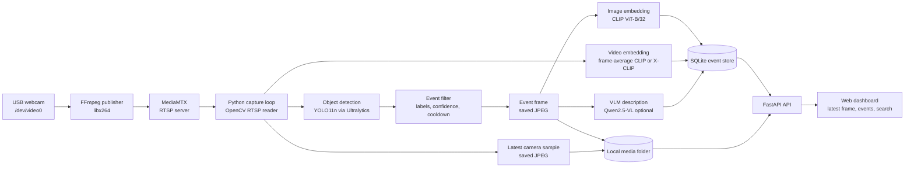

# edgeai-dx Vision Pipeline

This is a small edge AI vision pipeline I built as a working demo. The idea is simple: take a live webcam feed, turn it into an RTSP stream, run local AI models over the frames, store useful events, and show the results in a lightweight web dashboard.

It is not meant to be a huge production platform yet. It is more of a practical prototype for showing how the pieces fit together on a local Linux box or an edge AI machine.

Repo: https://github.com/litmosstest/edgeai-dx_visionpipeline

## Pipeline Diagram



## What It Uses

| Stage | Default model / tool | Runtime | Notes |
| --- | --- | --- | --- |
| Webcam publishing | FFmpeg + `libx264` | FFmpeg process | Reads `/dev/video0` and publishes RTSP. |
| RTSP server | MediaMTX | Docker container | Serves `rtsp://localhost:8554/webcam`. |
| Frame capture | OpenCV | Python | The API process reads the RTSP stream. |
| Object detection | `yolo11n.pt` | Ultralytics YOLO on PyTorch | Uses GPU if `VISION_DEVICE=cuda`, otherwise CPU. |
| Image embeddings | `sentence-transformers/clip-ViT-B-32` | SentenceTransformers / PyTorch | Produces 512d CLIP vectors for image search. |
| Video embeddings | frame-average CLIP | PyTorch + NumPy | Can be switched to X-CLIP with `microsoft/xclip-base-patch32`. |
| VLM descriptions | template by default, Qwen optional | Python template or Hugging Face Transformers | Qwen runs locally when `VISION_VLM_BACKEND=transformers`. |
| Storage | SQLite + local JPEGs | Local disk | Keeps event metadata, vectors, and image files. |
| Dashboard | FastAPI + plain HTML/CSS/JS | Python web server | Shows latest sample, events, boxes, and search. |

The main app is Python. The model inference path uses PyTorch directly; it is not using ONNX, TensorRT, llama.cpp, or GGUF by default.

## Quick Start

```bash
cp .env.example .env
python3 -m venv .venv
source .venv/bin/activate
pip install -e '.[models,dev]'
make up
```

Then open:

```text
http://localhost:8081
```

Useful commands:

```bash
make status
make logs
make restart
make down
```

`make up` starts MediaMTX, the FFmpeg webcam publisher, the API, and then starts the pipeline once RTSP is readable.

## Camera Notes

The default camera is:

```text
/dev/video0
```

If the webcam is on another device, run the publisher like this:

```bash
DEVICE=/dev/video2 SIZE=1280x720 FPS=30 ./scripts/publish_webcam_rtsp.sh
```

To check whether the RTSP stream is live:

```bash
./scripts/check_rtsp.sh
```

If Linux blocks access to the webcam, add your user to the `video` group and log out/back in:

```bash
sudo usermod -aG video "$USER"
```

Temporary fix for the current session:

```bash
sudo setfacl -m u:$USER:rw /dev/video0
```

## Config I Normally Use

For real local inference:

```bash
VISION_DETECTOR_BACKEND=yolo
VISION_DETECTOR_MODEL=yolo11n.pt
VISION_EMBEDDING_BACKEND=clip
VISION_EMBEDDING_MODEL=sentence-transformers/clip-ViT-B-32
VISION_TARGET_LABELS=person
VISION_MIN_CONFIDENCE=0.45
VISION_DEVICE=cuda
```

For Qwen VLM descriptions:

```bash
VISION_VLM_BACKEND=transformers
VISION_VLM_MODEL=Qwen/Qwen2.5-VL-3B-Instruct
```

For a lighter demo without downloading the bigger models:

```bash
VISION_DETECTOR_BACKEND=demo
VISION_EMBEDDING_BACKEND=hash
VISION_VLM_BACKEND=template
VISION_PUBLISHER=test
```

## What Gets Stored

Each event can store:

- camera id and timestamp
- detected labels and confidence
- bounding boxes
- saved event image
- image embedding vector
- video embedding vector
- optional VLM text description

The dashboard can show the latest frame, list events, draw boxes, and search stored events using text embeddings.

## Why This Exists

I wanted a simple end-to-end edge vision demo that shows the full loop, not just a single model notebook. The useful bit is seeing the practical plumbing together: camera input, RTSP, model inference, embeddings, local event memory, and a small UI for reviewing what happened.
